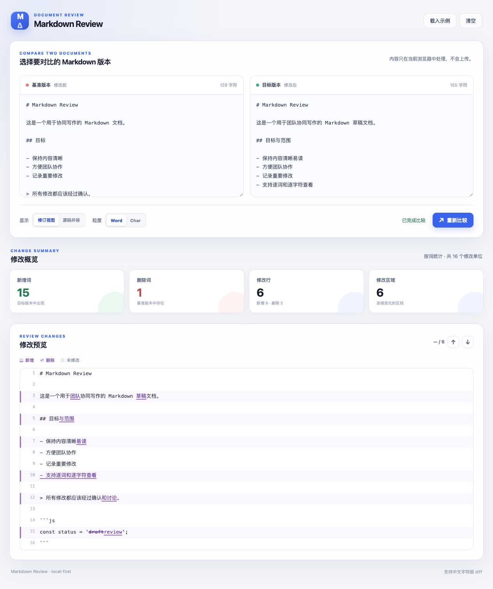
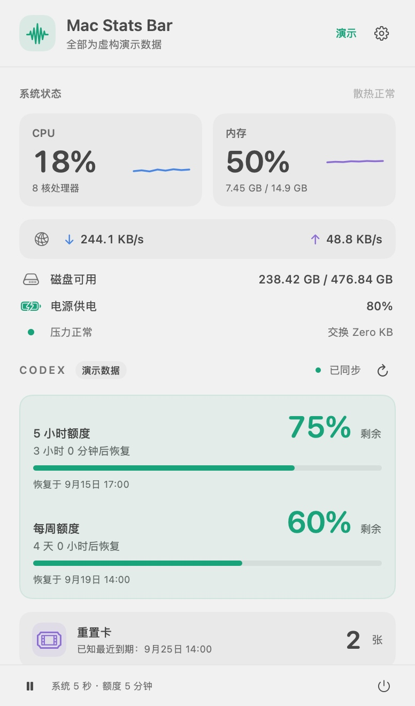

# 🪛 Screwdriver

一个小而灵巧的本地工具箱：专门处理那些“不值得开大炮，但又确实有点烦”的小问题。

每把工具都尽量做到：打开就能用、数据留在本地、界面不端着。螺丝有点松？拧一下就好。😈

## 工具箱

### Markdown Review

双 Markdown 文档对比工具，提供类似 Overleaf Review 的行内修订视图，也可以切换到源码并排模式。



它会把差异拆成容易读的“小动作”：

- 双文档输入：左边是修改前，右边是修改后
- 修订视图：新增内容带下划线，删除内容带删除线
- 源码并排：需要逐行核对时，左右对照更稳
- Word / Char 粒度：英文按词看，中文也能按字符看
- 修改统计：新增、删除、修改行和连续修改区域一眼可见
- 上一个 / 下一个修改：长文档里不用手动考古

> 适合：论文、README、会议纪要、产品文案，以及所有“我明明只改了几处，怎么变成这样”的 Markdown 文件。

### Markdown → Word

一个不绕弯子的 Markdown 转 Word 工具：粘贴内容或拖入 `.md` 文件，直接在浏览器里生成真正的 `.docx`。


- Word 原生结构：标题、列表、表格都保留为可编辑的 Word 元素
- 常用 Markdown：粗体、斜体、删除线、链接、引用、代码块、分隔线和简单表格
- 即时预览：导出前先看一眼接近 Word 的排版效果
- 文件名清理：自动补上 `.docx`，也会避开 Word 不接受的文件名字符
- 零上传：读取与生成都只发生在当前浏览器

> 第一版只输出现代 `.docx`。老式二进制 `.doc` 不只是换个后缀，因此暂时不做“假装支持”。图片目前会保留为文字说明。

### Mac Stats Bar

给 Mac 菜单栏装一个小抽屉：系统忙不忙、Codex 还剩多少额度，抬眼就知道。



截图使用虚构演示数据，不展示个人账户的真实额度。

- 原生 macOS 应用：Swift / AppKit / SwiftUI，无第三方包，不占 Dock 位置
- 系统状态：CPU、内存、网络上下行、磁盘、电池和散热状态
- Codex 额度：各额度组余量、恢复时间、倒计时和重置卡数量
- 展开托盘：小箭头展开刘海下方的面板；授权辅助功能后，可收纳与打开其他应用的菜单栏图标
- 按需刷新：系统默认 5 秒、额度默认 5 分钟；支持手动同步、暂停和可选登录启动

需要 **macOS 13+** 和 Apple Command Line Tools。Codex 额度另外需要本机安装 Codex 并登录；重置卡目前仅展示。

[打开工具说明](mac-stats-bar.html) · [构建与使用](mac-stats-bar/README.md) · [迁入与验证记录](mac-stats-bar/docs/integration.md)

> 托盘仍是预览功能：使用应用图标和应用原有菜单，不同应用的支持情况会有差异。先给拥挤的菜单栏腾个位置。😈

## 使用

| 工具 | 打开方式 |
| --- | --- |
| Markdown Review | 直接打开 [`index.html`](index.html) |
| Markdown → Word | 直接打开 [`md-to-docx.html`](md-to-docx.html) |
| Mac Stats Bar | 在 macOS 构建并打开下面的应用包 |

在仓库根目录运行：

```sh
./mac-stats-bar/scripts/build.sh
open "mac-stats-bar/dist/Mac Stats Bar Preview.app"
```

两个文档工具是纯前端、零依赖，处理过程都在当前浏览器中完成，也可以通过本地静态文件服务器打开。Mac Stats Bar 是独立原生应用；网页中的入口提供说明，实际状态显示在 macOS 菜单栏里。

## 设计口味

- local-first：先照顾手里的文件，再考虑联网服务
- small tools：一把工具解决一个具体的小麻烦
- readable diff：差异是给人看的，不是给日志看的
- friendly mischief：认真做事，偶尔眨一下眼睛 😈

## 开发

文档工具修改 HTML、CSS 或 JavaScript 后，刷新浏览器即可检查效果。Mac Stats Bar 的源码、构建和测试集中在 `mac-stats-bar/`，构建缓存与应用包不会进入版本控制。

```sh
node --test tests/docx-engine.test.js
./mac-stats-bar/scripts/test.sh
```

```text
screwdriver/
├── index.html
├── styles.css
├── app.js
├── diff-engine.js
├── md-to-docx.html
├── md-to-docx.js
├── docx-engine.js
├── mac-stats-bar.html
├── mac-stats-bar/
│   ├── README.md
│   ├── Package.swift
│   ├── Sources/
│   ├── Tests/
│   ├── Resources/
│   ├── scripts/
│   └── docs/
└── screenshots/
    ├── markdown-review.jpg
    ├── md-to-docx.jpg
    └── mac-stats-bar.jpg
```

## 隐私说明

- 文档工具只在当前浏览器中处理内容，不上传文档。
- Mac Stats Bar 的系统状态在本机采集；额度查询经本机 Codex 连接 OpenAI，复用已有登录状态，不读取或保存认证文件，不创建任务、不调用模型。
- 菜单栏收纳需要用户主动连接并授权辅助功能；无需录屏权限。
- Mac Stats Bar 截图使用虚构演示数据；历史记录保留资源采样，账户读数已移除。源码与截图不包含 API key、密码、私钥或个人文档内容。详见 [发布隐私检查](mac-stats-bar/docs/privacy-review.md)。

## License

MIT License，详见 [`LICENSE`](LICENSE)。
